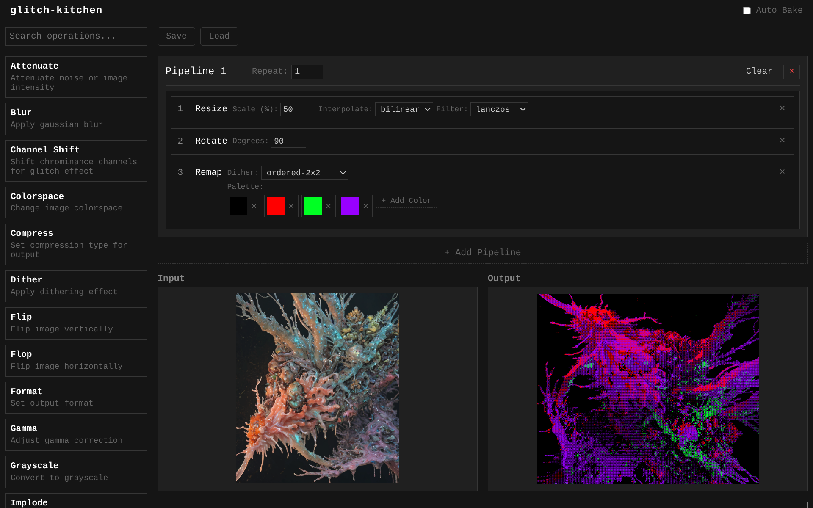

# Glitch Kitchen



Suite de procesado de imágenes inspirado en [Cyberchef](https://github.com/gchq/cyberchef) para encadenar efectos de imágenes y modificaciones.

## Stack

- Bun + Typescript
- Imagemagick CLI
- HTML+CSS+Dragula

## Instalación

1. Instala [Imagemagick](https://imagemagick.org/), es el encargado de procesar las imagenes.
2. Instala [https://bun.com/](https://bun.com/) para el backend.
3. Clona el repositorio y lanza el servidor con `bun run dev`

```bash
sudo apt install imagemagick
curl -fsSL https://bun.sh/install | bash
git clone https://github.com/datadiego/glitch-kitchen
cd glitch-kitchen
bun run dev
```

## Uso

En el panel de la izquierda tienes diferentes **operaciones**, son los efectos y modificaciones que puedes realizar a tu imagen.

Arrastra tu operacion al **pipeline**, haz click en **Bake!** y obtendrás tu imagen procesada.

Puedes añadir multiples operadores al pipeline y se ejecutarán en ese orden. Reordenalos arrastrandolos dentro del pipeline.

Puedes añadir más pipelines, renombrarlos y reordenarlos. Cada pipeline tiene un modificador de **repeat** que repetirá *n* veces todo el pipeline antes de pasar al siguiente, esto es perfecto para efectos de feedback agresivos.

Exporta todos los pipelines como un json para poder tenerlo disponible en otra ocasión o compartirlo con otros usuarios, o genera un script `bash` para poderlo ejecutar sin necesidad de **glitch-kitchen**.
